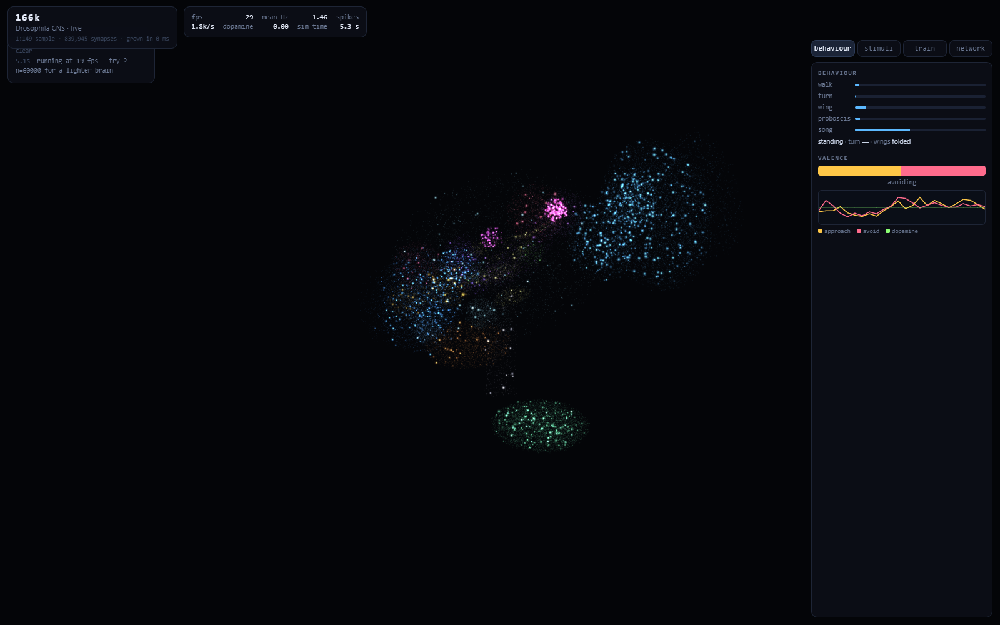
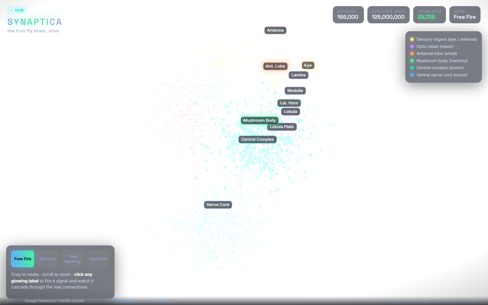
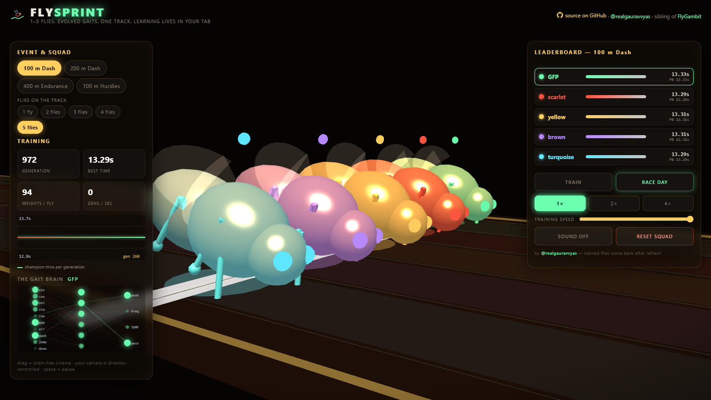
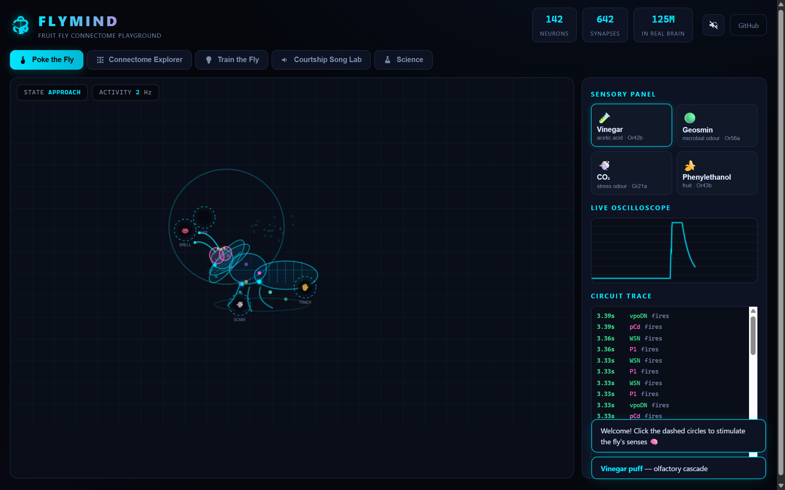
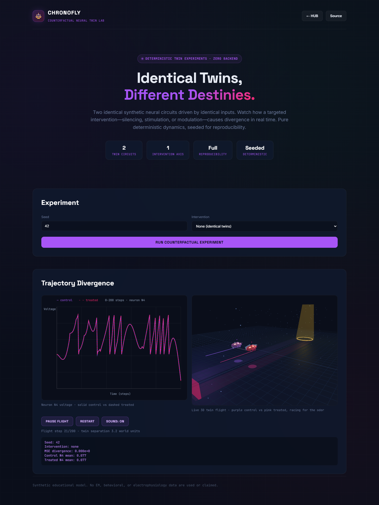
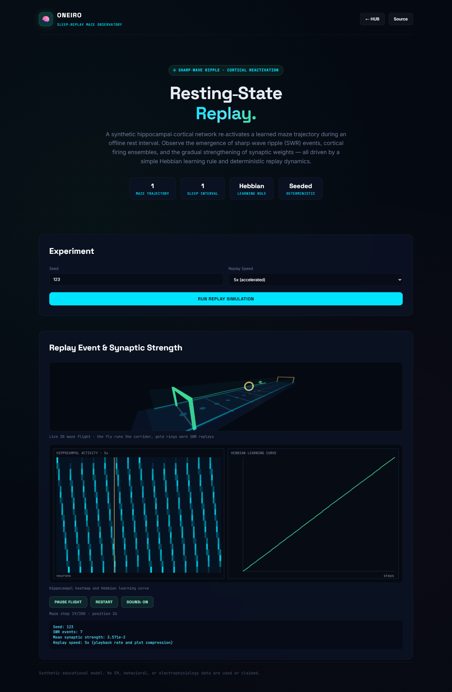

# CONNECTOMICS 🪰⚡
### In-Silico Drosophila Central Nervous System Simulation & Behavioral Mapping Suite

<p align="center">
  <a href="https://realgauravvyas.github.io/connectomics/">
    
  </a>
  <a href="https://realgauravvyas.github.io/connectomics/">
    
  </a>
</p>

[](https://research.google/blog/a-connectomics-milestone-mapping-the-complete-male-fruit-fly-brain/)
[](https://realgauravvyas.github.io/connectomics/)
[](https://realgauravvyas.github.io/connectomics/)
[](https://realgauravvyas.github.io/connectomics/)
[](https://realgauravvyas.github.io/connectomics/)
[](https://opensource.org/licenses/MIT)

> 🌐 **Experience the Complete Suite Live Online:**  
> 👉 **[https://realgauravvyas.github.io/connectomics/](https://realgauravvyas.github.io/connectomics/)**  
> *Nine interconnected neuro-computational paradigms running client-side in your web browser with zero backend, zero build steps, and zero dependencies.*

Inspired by the landmark Google Research, Howard Hughes Medical Institute (HHMI Janelia), and FlyEM Consortium publication:  
**"Sexual dimorphism in the complete connectome of the Drosophila male central nervous system"** (*Cell*, September 2026).

---

## 🖥️ Dashboard Gallery

<p align="center">
  <b>MUSCA</b> — Full EM Connectome Atlas (166,700 neurons)<br>
  <a href="https://realgauravvyas.github.io/connectomics/musca/">
    
  </a>
</p>

<p align="center">
  <b>166k</b> — Spiking Neural Network Electrophysiology<br>
  <a href="https://realgauravvyas.github.io/connectomics/166k/">
    
  </a>
</p>

<p align="center">
  <b>SYNAPTICA</b> — 3D Neuropil Circuit Play<br>
  <a href="https://realgauravvyas.github.io/connectomics/synaptica/">
    
  </a>
</p>

<p align="center">
  <b>FlyGambit</b> — Sparse Reinforcement Learning Chess<br>
  <a href="https://realgauravvyas.github.io/connectomics/fly-gambit/">
    
  </a>
</p>

<p align="center">
  <b>FlySprint</b> — Genetic Locomotion Evolution<br>
  <a href="https://realgauravvyas.github.io/connectomics/fly-sprint/">
    
  </a>
</p>

<p align="center">
  <b>FLYMIND</b> — Sensory Electrophysiology Lab<br>
  <a href="https://realgauravvyas.github.io/connectomics/flymind/">
    
  </a>
</p>

<p align="center">
  <b>FLYKICK</b> — Connectome Football<br>
  <a href="https://realgauravvyas.github.io/connectomics/flykick/">
    
  </a>
</p>

<p align="center">
  <b>CHRONOFLY</b> — Counterfactual Neural Twin Lab<br>
  <a href="https://realgauravvyas.github.io/connectomics/chronofly/">
    
  </a>
</p>

<p align="center">
  <b>ONEIRO</b> — Sleep-Replay Maze Observatory<br>
  <a href="https://realgauravvyas.github.io/connectomics/oneiro/">
    
  </a>
</p>

---

## 🌟 The Simulation Suite at a Glance


The **CONNECTOMICS** suite brings together multiple distinct in-silico modeling paradigms, spanning from micro-scale electron-microscopy connectivity matrices to whole-organism cybernetic embodiment.

```
                                              CONNECTOMICS SUITE
                                 (Google Research × HHMI Janelia MaleCNS Data)
                                                       │
  ┌──────────────┬──────────────┬──────────────┬───────┴──────┬──────────────┬──────────────┬──────────────┐
  ▼              ▼              ▼              ▼              ▼              ▼              ▼
[MUSCA]       [166k]       [SYNAPTICA]   [FlyGambit]    [FlySprint]    [FLYMIND]      [FLYKICK]
Full EM       LIF Spiking  3D Neuropils  Sparse RL      Gait Evolution Sensory Lab    Connectome FB
• 166.7k Soma • 166k SNN   • 12 Hubs     • Chess Engine • 94-Weight CPG• 42 Classes   • 5v5 Match
• 2.82M Edges • 2.3M Syn   • Hebbian     • Lesion Sandb • 4 Distances  • Oscilloscope • Brain Cam
• Reverse Cir • Dopamine   • Sensory     • REINFORCE    • Hurdles Jump • Song Synth   • Possession
• Atlas/Poke  • Conditioning• Free Fire  • Zero Deps    • Director Cam • Touch/Smell  • Web Audio
```

---

## 🔬 Comparative Simulator Matrix

| Project | Target Scope | Neurons / Synapses | Core Mechanism | Behavioral Integration | Launch |
|---|---|---|---|---|:---:|
| [**MUSCA**](musca/) | Reconstructed EM Connectome | 166,700 neurons<br>2,822,334 edges | Reconstructed 3D soma coordinates + 1.1M synapse point-cloud | **Reverse Search:** 9 verified sensory-motor circuits (escape jump, song, odor, shadow) | [Launch MUSCA](https://realgauravvyas.github.io/connectomics/musca/) |
| [**166k**](166k/) | Large-Scale SNN Electrophysiology | 166,000 neurons<br>2,300,000 synapses | Leaky Integrate-and-Fire (LIF) + 4:1 E/I population balance | **Associative Conditioning:** PPL1 dopamine shock pairing + ablation proof | [Launch 166k](https://realgauravvyas.github.io/connectomics/166k/) |
| [**SYNAPTICA**](synaptica/) | Macro Neuropil Circuit Play | 12 mapped neuropils<br>125M mapped synapses | Topologically-routed action potential cascades | **Hebbian Learning:** Real-time Mushroom Body synaptic plasticity gauge | [Launch SYNAPTICA](https://realgauravvyas.github.io/connectomics/synaptica/) |
| [**FlyGambit**](fly-gambit/) | Sparse Reinforcement Learning | ~1,200 neurons<br>~28,000 synapses | Biologically sparse fan-in ($k=20$) + REINFORCE value baseline | **Neuropil Lesioning:** Silence Optic, Lobula, Mushroom Body, or Central Complex mid-game | [Launch FlyGambit](https://realgauravvyas.github.io/connectomics/fly-gambit/) |
| [**FlySprint**](fly-sprint/) | Genetic Biomechanical Evolution | 10 $\to$ 6 $\to$ 4 MLP<br>94 weights / runner | Genetic algorithm evolving Central Pattern Generator (CPG) locomotion | **Track Competition:** 100m, 200m, 400m pacing & 10-barrier hurdles | [Launch FlySprint](https://realgauravvyas.github.io/connectomics/fly-sprint/) |
| [**FLYMIND**](flymind/) | Sensory Electrophysiology Lab | 42 neuron classes<br>642 synaptic edges | Event-driven firing cascades + real-time oscilloscope & BFS tracer | **Multi-Modal Play:** Touch poke, odor conditioning, courtship acoustic synthesis | [Launch FLYMIND](https://realgauravvyas.github.io/connectomics/flymind/) |
| [**FLYKICK**](flykick/) | Team Sports Connectome Sim | 10 flies $\times$ 11 neurons<br>110 active nodes | Autonomous multi-agent coordination + manual Central Complex hijack | **Neural Football:** 2 teams $\times$ 5 flies, live Brain Cam, charge kicks | [Launch FLYKICK](https://realgauravvyas.github.io/connectomics/flykick/) |
| [**CHRONOFLY**](chronofly/) | Counterfactual Twin Experiment | 2 twins $\times$ 6 synthetic neurons<br>200 steps | Seeded recurrent LIF dynamics with a targeted N4 intervention | **Counterfactual Divergence:** identical inputs, 3D twin flight — control versus silenced/stimulated/modulated twin | [Launch CHRONOFLY](https://realgauravvyas.github.io/connectomics/chronofly/) |
| [**ONEIRO**](oneiro/) | Synthetic Sleep-Replay Observatory | 20 place-tuned neurons<br>100-position maze | Deterministic Gaussian place fields, SWR-like events, Hebbian potentiation | **Offline Replay:** 3D maze flight, trajectory reactivation and learning-curve telemetry | [Launch ONEIRO](https://realgauravvyas.github.io/connectomics/oneiro/) |

---

## 🧠 Complete Nervous System Architecture

```
  [ SENSORY PERCEPTION ]
    • Photons & Optical Flow   ──►  Optic Lobes (Lamina → Medulla → Lobula → LPTCs)
    • Odorants & Pheromones    ──►  Antennal Lobes (Glomeruli) → Mushroom Body (Kenyon Cells)
    • Acoustic Vibrations      ──►  Johnston's Organ (JO-A1) → Antennal Mechanosensory Center (AMMC)
             │
             ▼
  [ CENTRAL INTEGRATION & MEMORY ]
    • Heading Navigation       ──►  Central Complex (Ellipsoid Body Ring Attractor)
    • Associative Learning     ──►  Mushroom Body Output Neurons (MBONs) + Dopamine (PPL1 / PAM)
    • Courtship & Mate Choice  ──►  P1 Courtship Hub (Male-Specific Fru+/Dsx+ Clusters)
             │
             ▼
  [ MOTOR COMMAND (DESCENDING PATHWAYS) ]
    • Giant Fiber Takeoff      ──►  DNp01 (Escape Jump Command)
    • Courtship Sing Back      ──►  DNp02 (Unilateral Wing Extension)
    • Steering Modulation      ──►  DNp31 (Flight Motor Coordination)
             │
             ▼
  [ VENTRAL NERVE CORD & EFFECTORS ]
    • T1 Neuromeres            ──►  Forelegs (Grooming & Substrate Sensing)
    • T2 Neuromeres            ──►  Flight & Wing Vibration (Pulse & Sine Song)
    • T3 Neuromeres            ──►  Tergal Trochanter Jump Muscles (TTMn)
```

---

## 🚀 Quick Start & Local Serving

Every simulator in the suite is built with **zero dependencies** and requires **no compilation step**:

```bash
# Clone the repository
git clone https://github.com/realgauravvyas/connectomics.git
cd connectomics

# Start any local HTTP server (Python 3):
python -m http.server 8000

# Open in your browser:
# http://localhost:8000/
```

### 🧪 Unified Verification Suite (Single Command)

Run all 11 automated checks across the complete 9-app simulator suite with a single command:

```bash
# Run all tests across all 9 projects
npm test

# or directly with Node:
node test-all.mjs
```

### Running Sub-Project Offline Tests Individually
```bash
# 166k headless WebGL and electrophysiology test
cd 166k && node tools/analyze.mjs && cd ..

# MUSCA 9-circuit biological reverse search verification
cd musca && python tools/behaviours.py && cd ..

# FlyGambit 100-game reinforcement learning verification
cd fly-gambit && node test/smoke.mjs && cd ..

# FlySprint genetic algorithm gait evolution verification
cd fly-sprint && node test/smoke.mjs && cd ..

# FLYMIND 4-suite neural cascade and mushroom body verification
cd flymind && npm test && cd ..

# FLYKICK 16-check physics, AI match, and possession verification
cd flykick && node tools/test-engine.js && cd ..

# CHRONOFLY deterministic counterfactual-twin verification
cd chronofly && node test/smoke.mjs && cd ..

# ONEIRO deterministic sleep-replay verification
cd oneiro && node test/smoke.mjs && cd ..
```

---

## 🌐 Instant GitHub Pages Deployment

The repository includes an automated GitHub Actions deployment workflow ([`.github/workflows/pages.yml`](.github/workflows/pages.yml)).
Pushing to the `main` branch automatically deploys the suite to:  
`https://realgauravvyas.github.io/connectomics/`

---

## 📚 Scientific References & Data Provenance

1. **Cell Publication:**  
   Google Research, Howard Hughes Medical Institute (HHMI Janelia), and the FlyEM Consortium.  
   *"Sexual dimorphism in the complete connectome of the Drosophila male central nervous system"*, **Cell** (September 2026). DOI: [10.1016/j.cell.2026.08.015](https://doi.org/10.1016/j.cell.2026.08.015).
2. **Google Research Blog:**  
   [A connectomics milestone: Mapping the complete male fruit fly brain](https://research.google/blog/a-connectomics-milestone-mapping-the-complete-male-fruit-fly-brain/).
3. **HHMI Janelia MaleCNS Portal:**  
   [male-cns.janelia.org](https://male-cns.janelia.org/).
4. **Google Neuroglancer:**  
   [Open-source connectomics 3D volume viewer](https://github.com/google/neuroglancer).

---

## 👤 Author & Research

**Gaurav Vyas**  
- 🌐 **Personal Website & Academic Profile:** [socialpsychology.org/member/gaurav-vyas](https://www.socialpsychology.org/member/gaurav-vyas)  
- 🔶 **Interactive Portfolio:** [realgauravvyas.github.io](https://realgauravvyas.github.io/)  
- 🐙 **GitHub:** [@realgauravvyas](https://github.com/realgauravvyas)  

---

## 📄 License

MIT License &copy; 2026 Gaurav Vyas. Open-source science for everyone.
