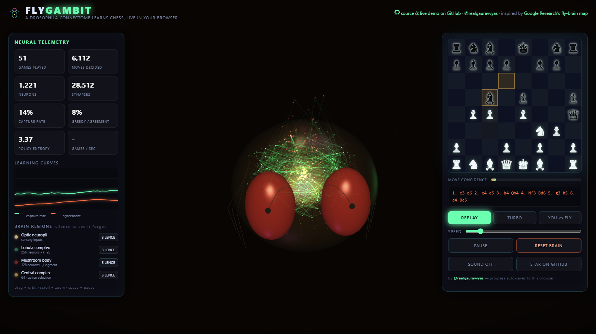
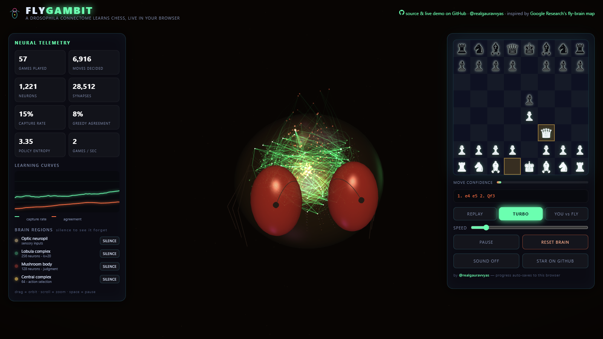
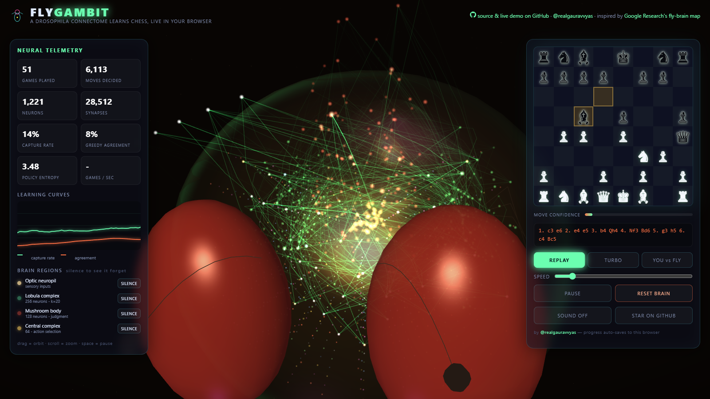
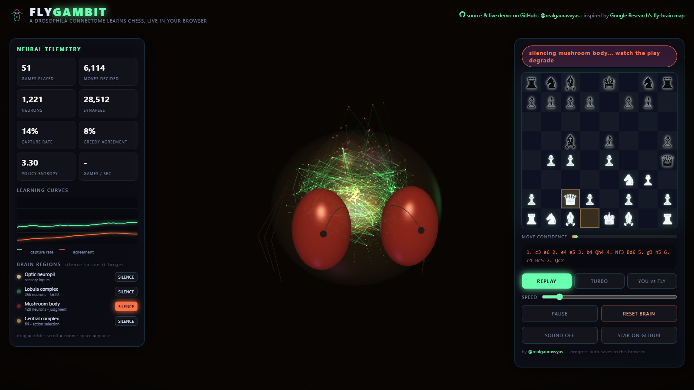

# FlyGambit 🪰♟️
### A Fruit Fly Connectome Learns Chess — Live in Your Web Browser

<p align="center">
  <a href="https://realgauravvyas.github.io/connectomics/fly-gambit/">
    
  </a>
  <a href="https://realgauravvyas.github.io/connectomics/">
    
  </a>
</p>

[](https://research.google/blog/a-connectomics-milestone-mapping-the-complete-male-fruit-fly-brain/)
[](https://realgauravvyas.github.io/connectomics/fly-gambit/)
[](https://realgauravvyas.github.io/connectomics/fly-gambit/)
[](https://realgauravvyas.github.io/connectomics/fly-gambit/)
[](https://realgauravvyas.github.io/connectomics/fly-gambit/)
[](https://realgauravvyas.github.io/connectomics/fly-gambit/)
[](https://opensource.org/licenses/MIT)

> 🎮 **Play Live in Your Browser:**  
> 👉 **[https://realgauravvyas.github.io/connectomics/fly-gambit/](https://realgauravvyas.github.io/connectomics/fly-gambit/)**  
> *Part of the [CONNECTOMICS Suite](https://realgauravvyas.github.io/connectomics/) by Gaurav Vyas.*

Nobody teaches a *fly* chess. Neural network chess engines are typically dense multi-layer perceptrons or massive transformers trained on millions of grandmaster games. **FlyGambit takes the opposite approach:** it constructs a sparse, connectome-constrained artificial brain modeled on the anatomical neuropil regions of the male *Drosophila melanogaster* central nervous system (mapped in [Google Research & HHMI Janelia's milestone][blog]).

As the fly plays, **every single synapse fires in real time** across a glowing 3D anatomical specimen with procedural fluorescence microscopy aesthetics.

> ⚡ **Zero Server. Zero Pretrained Weights. Zero Python.**  
> The reinforcement learning loop runs entirely client-side in your tab via typed arrays. Close or refresh the tab, and the fly remembers its learned policy through `localStorage`.

---

## 📸 Interactive Visual Showcase

| **REPLAY MODE** — Every move pulses live synapses | **TURBO TRAINING** — Background self-play at full speed |
|:--:|:--:|
|  |  |
| **FLUORESCENCE MACRO** — GFP Lobula, tdTomato MB, Gold CX | **LESION SANDBOX** — Silence a neuropil and watch play collapse |
|  |  |

---

## 🎮 Play Modes & Interactive Features

| Mode | Real-Time Mechanism |
|---|---|
| **REPLAY** | Self-play games executed at human watchable pace. Every move pulses real synaptic activations: Optic Neuropil → Lobula Complex → Mushroom Body → Central Complex. |
| **TURBO** | High-throughput training loop runs at maximum hardware speed in the background while a showcase board visualizes games. Real-time sparklines display capture rate & greedy agreement. |
| **YOU vs FLY** | Play White against the fly (Black). The fly *learns continuously from your moves* in real time, absorbing tactical patterns from games it loses. |
| **PROCEDURAL SOUND** | Synthesized purely via Web Audio API (zero audio samples): micro-tonal synaptic blips per piece type, percussive thumps on captures, harmonic arpeggios on checkmate, and falling zap filters during neuropil silencing. |

---

## 🔬 Experimental Neuropil Lesioning

The standout feature of FlyGambit is **live brain region ablation**. In real neurobiology, connectomes are used to design targeted silencing and optogenetic activation experiments. FlyGambit brings this directly into the chess engine:

| Neuropil Region | Real *Drosophila* Anatomy | Chess Functional Role | Silencing Effect |
|---|---|---|---|
| **Optic Neuropil** (773) | Retina, Lamina, Medulla | 8×8 board state & 12 piece-planes | Blinded board perception; erratic moves |
| **Lobula Complex** (256, k=20) | Lobula Plate | Tactical pattern & threat extraction | Misses tactical forks & open lines |
| **Mushroom Body** (128, k=20) | $\alpha$/$\beta$ lobes (Kenyon Cells) | Position evaluation & value baseline | Forgets strategic positional valuation |
| **Central Complex** (64) | Ellipsoid Body ring | Motor action selection & move choice | Complete loss of intent; pure random walk |

> 🧪 **Try it:** Click **SILENCE** on the Mushroom Body mid-game to strip the fly's ability to judge advantage, or silence the Central Complex to induce motor ataxia.

---

## 🧠 Computational Neuroanatomy & Learning Dynamics

- **Sparse Connectome Architecture (`js/connectome.js`):** Unlike standard dense MLPs, FlyGambit enforces a strict biologically sparse fan-in constraint ($k=20$ synapses per neuron) with fixed, structured wiring reflecting biological neuropil bottlenecks.
- **Policy Gradient Learning:** Trained via **REINFORCE** combined with a learned value baseline and an Adam optimizer running one step per self-play game.
- **Reward Function:**
  - $\pm 1.0$ for Checkmate
  - Discounted material swings over game progression (capture-shaping reward)
  - $0$ for Draws (stalemate, 50-move rule, threefold repetition)
- **Zero Piece Knowledge:** The fly is never given piece rules, point values, or opening books. It only receives binary spatial occupancy across piece planes and discovers captures and piece values organically.

---

## 🧪 Automated Testing & Verification

Run the headless self-play verification test suite:

```bash
node test/smoke.mjs
```

**Expected verification output:**
```
capture rate first25: 0.143  next75: 0.189
PASS: fly is learning to capture
PASS: weights contain zero NaNs after 100 games
PASS: policy distribution softmax valid
```

---

## 📁 Repository Structure

```
fly-gambit/
├── index.html              # Complete WebGL application shell & HUD
├── css/style.css           # Fluorescence microscopy dark-theme CSS
├── js/
│   ├── connectome.js       # Sparse neural layers, REINFORCE & Adam (DOM-free)
│   ├── chessai.js          # Self-play loop, feature tensors, evaluation (DOM-free)
│   ├── brain-viz.js        # Three.js 3D articulated fly + synaptic axon pulse
│   ├── chart.js            # Real-time SVG/Canvas learning sparklines
│   ├── audio.js            # Procedural Web Audio API sound generator
│   └── main.js             # UI state, board interaction, lesion sandbox
├── vendor/
│   ├── three.min.js        # Three.js r128 (MIT)
│   └── chess.mjs           # chess.js 1.0 (BSD-2)
├── test/
│   └── smoke.mjs           # Node.js 100-game learning verification
└── assets/
    ├── favicon.svg         # High-resolution vector icon
    └── screens/            # Visual documentation captures
```

---

## 🌐 Complete Connectomics Ecosystem

FlyGambit is a core engine in the [**CONNECTOMICS**](https://realgauravvyas.github.io/connectomics/) suite:

- 🏃 **[FlySprint](https://realgauravvyas.github.io/connectomics/fly-sprint/):** 1–5 evolved flies with 94-weight neural gait controllers race 100m, 200m, 400m, and hurdles.
- 🔬 **[MUSCA](https://realgauravvyas.github.io/connectomics/musca/):** 166,700 reconstructed neurons with 2.82M edges and reverse behavior search.
- ⚡ **[166k](https://realgauravvyas.github.io/connectomics/166k/):** Large-scale Leaky Integrate-and-Fire (LIF) spiking electrophysiology with dopamine conditioning.
- 🌌 **[SYNAPTICA](https://realgauravvyas.github.io/connectomics/synaptica/):** 12 mapped neuropil hubs with real-time Hebbian plasticity tracking.

---

## 📚 Scientific References & Data

- Google Research, HHMI Janelia, FlyEM Consortium:  
  *"Sexual dimorphism in the complete connectome of the Drosophila male central nervous system"*, **Cell** (September 2026).
- Google Research Announcement:  
  [A connectomics milestone: Mapping the complete male fruit fly brain][blog].
- FlyWire Whole-Brain Consortium (Nature 2024).

[blog]: https://research.google/blog/a-connectomics-milestone-mapping-the-complete-male-fruit-fly-brain/

---

## 👤 Author

**Gaurav Vyas**  
- 🌐 **Academic Profile:** [socialpsychology.org/member/gaurav-vyas](https://www.socialpsychology.org/member/gaurav-vyas)  
- 🔶 **Interactive Portfolio:** [realgauravvyas.github.io](https://realgauravvyas.github.io/)  
- 🐙 **GitHub:** [@realgauravvyas](https://github.com/realgauravvyas)  
- 🪰 **Full Connectomics Suite:** [realgauravvyas.github.io/connectomics](https://realgauravvyas.github.io/connectomics/)

---

## 📄 License

MIT License &copy; 2026 Gaurav Vyas. Open-source science for everyone.
