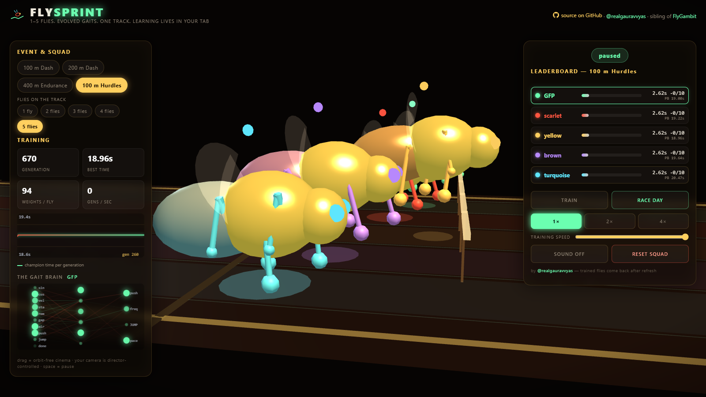
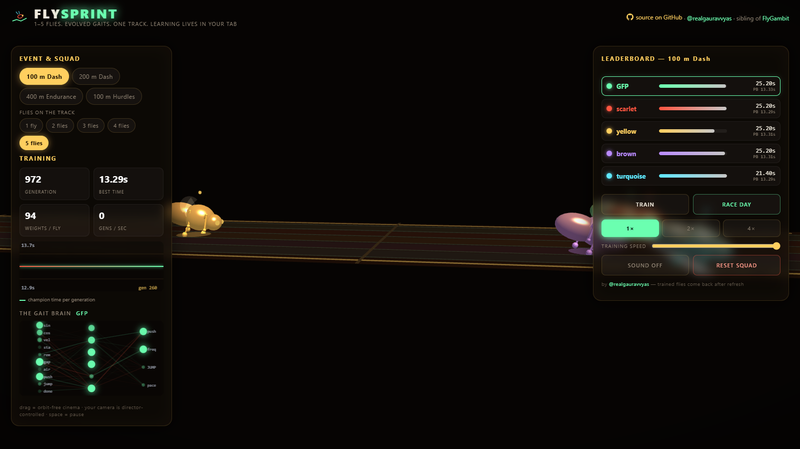

# FlySprint 🪰🏃
### Genetic Evolution Learns Drosophila Gait Locomotion — Live in Your Web Browser

<p align="center">
  <a href="https://realgauravvyas.github.io/connectomics/fly-sprint/">
    
  </a>
  <a href="https://realgauravvyas.github.io/connectomics/">
    
  </a>
</p>

[](https://research.google/blog/a-connectomics-milestone-mapping-the-complete-male-fruit-fly-brain/)
[](https://realgauravvyas.github.io/connectomics/fly-sprint/)
[](https://realgauravvyas.github.io/connectomics/fly-sprint/)
[](https://realgauravvyas.github.io/connectomics/fly-sprint/)
[](https://realgauravvyas.github.io/connectomics/fly-sprint/)
[](https://realgauravvyas.github.io/connectomics/fly-sprint/)
[](https://opensource.org/licenses/MIT)

> 🎮 **Watch the Races Live in Your Browser:**  
> 👉 **[https://realgauravvyas.github.io/connectomics/fly-sprint/](https://realgauravvyas.github.io/connectomics/fly-sprint/)**  
> *Part of the [CONNECTOMICS Suite](https://realgauravvyas.github.io/connectomics/) by Gaurav Vyas.*

**1 to 5 flies. Evolved gaits. One Olympic-scale track. Zero hand-crafted animations.**

Every runner on the track is powered by an embodied neural gait controller (`10 inputs → 6 hidden → 4 outputs`, **94 synaptic weights**) learning to sprint and jump hurdles completely from scratch in your browser tab. Nobody coded a tripod gait, a stride cycle, or hurdle jump timings: every movement pattern emerges organically through genetic evolution across generations.

> ⚡ **Zero Server. Zero Pretrained Weights. Zero Python.**  
> Train 1,000 generations in ~20 seconds using frame-sliced background computation that never locks your UI. Hit **RACE DAY**, and watch your trained insect champions compete in real-time 3D with director camera tracking.

---

## 📸 Interactive Visual Showcase

| **RACE DAY** — Six-legged biomechanics driven by live neural nets | **100m HURDLES** — Barrier clearance is evolved, not scripted |
|:--:|:--:|
|  |  |
| **TRAINING MODE** — Watch champion race splits tumble across generations | **THE GAIT BRAIN** — Live 94-weight neural wiring diagram pulsing in real-time |
|  | *(Rendered live on the telemetry HUD)* |

---

## 🏃 Track Events & Competition Modes

| Event | Distance & Obstacles | Evolutionary Challenge |
|---|---|---|
| **100 m Sprint** | Flat 100 meters | Pure acceleration, ground-contact optimization, and rapid frequency modulation. |
| **200 m Dash** | Extended flat sprint | Balancing peak burst speed with mid-race stamina expenditure. |
| **400 m Endurance** | Full lap sprint | Pacing strategy: flies that sprint all-out exhaust their stamina and stumble; winners evolve intelligent split times. |
| **100 m Hurdles** | 10 physical hurdle barriers | Vision/distance sensory coupling: the neural controller must sense proximity, suppress forward thrust, and execute timed vertical jump impulses. |

Flies are color-coded and named after key fluorescent biomarkers in genetic microscopy: **GFP** (emerald green), **Scarlet** (crimson), **Yellow** (amber gold), **Brown** (bronze), and **Turquoise** (electric cyan).

---

## 🔬 Biomechanics & Central Pattern Generator (CPG) Architecture

### 1. Neuromuscular Controller (94 Synaptic Weights)
The neural architecture is a streamlined biologically-inspired multi-layer controller:
- **Sensory Inputs (10):** Hip oscillator phase ($\sin\theta$, $\cos\theta$), instantaneous velocity, stamina percentage, race completion ratio, proximity to next hurdle, airborne state boolean, previous motor outputs (efferent copy), and hurdles cleared.
- **Hidden Processing (6):** Non-linear tanh activation layer.
- **Motor Outputs (4):** Forward thrust impulse, stride frequency modulation, vertical jump trigger, and pacing reserve governor.

### 2. Physical Locomotion Rules
- **Phase-Gated Thrust:** Forward propulsion is strictly physics-gated. Force is only transmitted to the substrate when feet are grounded during the correct phase of the stride cycle.
- **Airborne Penalty:** Jumping indiscriminately eliminates ground friction and thrust. Flies that spam jump decelerate, forcing clean hurdle clearance to evolve naturally.
- **Dynamic Stamina Dynamics:** High motor effort depletes metabolic stamina. Easing throttle regenerates reserves, punishing naive all-out rushers in longer races.

### 3. Evolutionary Genetic Algorithm
- **Population:** Lineage-tracked populations of 16 individuals per lane.
- **Selection:** Elitism preserves the top champion; tournament selection picks parents with uniform crossover.
- **Adaptive Mutation:** Annealed Gaussian weight perturbations refine motor timing.
- **Fitness Evaluation:** Composite metric of finish time plus weighted penalty for hurdle collisions and stumbles.

---

## 🧪 Automated Headless Test Suite

Verify evolutionary progress and hurdle clearance via the Node.js test runner:

```bash
node test/smoke.mjs
```

**Benchmark Results:**
```
100m:  untrained 21.1s -> 90 gens 13.3s
100mH: best 18.7s, cleared 10/10, stumbles 0
PASS: flies evolve faster, hurdle champions fly clean
```

---

## 📁 Repository Structure

```
fly-sprint/
├── index.html              # 3D stadium, director camera, telemetry interface
├── css/style.css           # High-contrast stadium HUD styling
├── js/
│   ├── sim.js              # Gait physics & genetic algorithm engine (DOM-free)
│   ├── fly3d.js            # Three.js track, hurdles, 6-legged flies, camera director
│   ├── brain2d.js          # Live 2D canvas showing 94-synapse activations
│   ├── chart.js            # Real-time SVG/Canvas performance curve
│   ├── audio.js            # Procedural starter pistol, hurdles, crowd, and fanfare
│   └── main.js             # UI state machine, frame-sliced training, races
├── vendor/
│   └── three.min.js        # Three.js r128 (MIT)
├── test/
│   └── smoke.mjs           # Automated headless evolutionary benchmark
└── assets/
    ├── favicon.svg         # High-resolution vector icon
    └── screens/            # Photographic race captures
```

---

## 🌐 Complete Connectomics Ecosystem

FlySprint is an integral component of the [**CONNECTOMICS**](https://realgauravvyas.github.io/connectomics/) simulation suite:

- ♟️ **[FlyGambit](https://realgauravvyas.github.io/connectomics/fly-gambit/):** Sparse *Drosophila* connectome learning chess in real time with interactive brain lesioning.
- 🔬 **[MUSCA](https://realgauravvyas.github.io/connectomics/musca/):** 166,700 reconstructed neurons with 2.82M edges and reverse behavior search.
- ⚡ **[166k](https://realgauravvyas.github.io/connectomics/166k/):** Large-scale Leaky Integrate-and-Fire (LIF) spiking electrophysiology with dopamine conditioning.
- 🌌 **[SYNAPTICA](https://realgauravvyas.github.io/connectomics/synaptica/):** 12 mapped neuropil hubs with real-time Hebbian plasticity tracking.
- 🧠 **[FLYMIND](https://realgauravvyas.github.io/connectomics/flymind/):** Interactive connectome playground: poke senses, train mushroom body, explore 42 neuron classes.
- ⚽ **[FLYKICK](https://realgauravvyas.github.io/connectomics/flykick/):** 2 teams of neural flies play football with real-time Brain Cam and manual possession override.

---

## 📚 Scientific References

- Google Research, HHMI Janelia, FlyEM Consortium:  
  *"Sexual dimorphism in the complete connectome of the Drosophila male central nervous system"*, **Cell** (September 2026).
- Google Research Announcement:  
  [A connectomics milestone: Mapping the complete male fruit fly brain][blog].

[blog]: https://research.google/blog/a-connectomics-milestone-mapping-the-complete-male-fruit-fly-brain/

---

## 👤 Author

**Gaurav Vyas**  
- 🌐 **Academic Profile:** [socialpsychology.org/member/gaurav-vyas](https://www.socialpsychology.org/member/gaurav-vyas)  
- 🔶 **Interactive Portfolio:** [realgauravvyas.github.io](https://realgauravvyas.github.io/)  
- 🐙 **GitHub:** [@realgauravvyas](https://github.com/realgauravvyas)  
- 🪰 **Full Connectomics Suite:** [realgauravvyas.github.io/connectomics](https://realgauravvyas.github.io/connectomics/)

---

## 📄 License

MIT License &copy; 2026 Gaurav Vyas. Open-source science for everyone.
