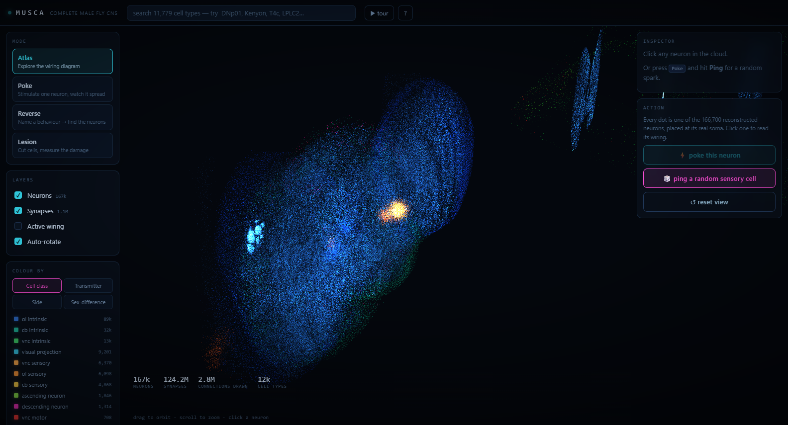
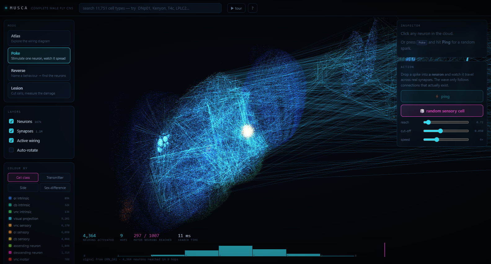
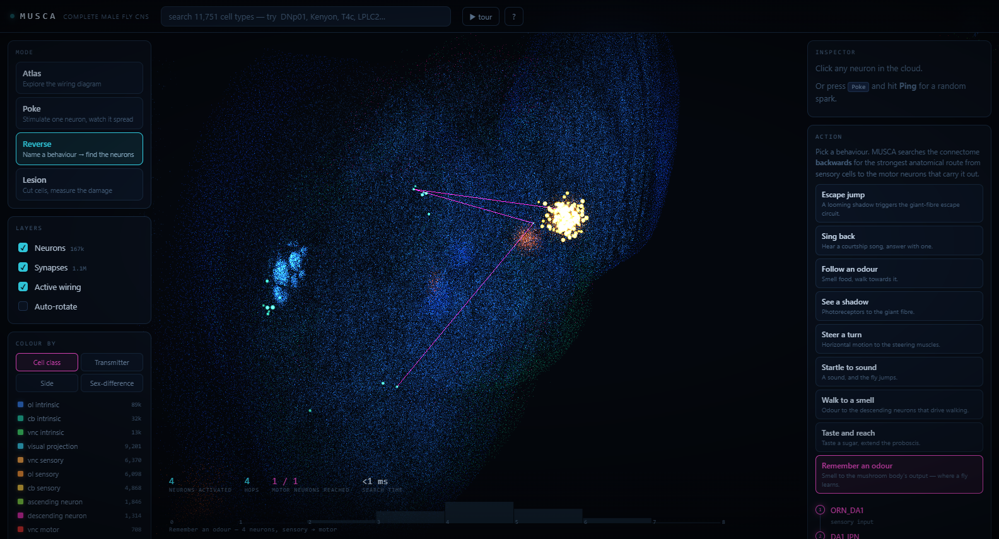
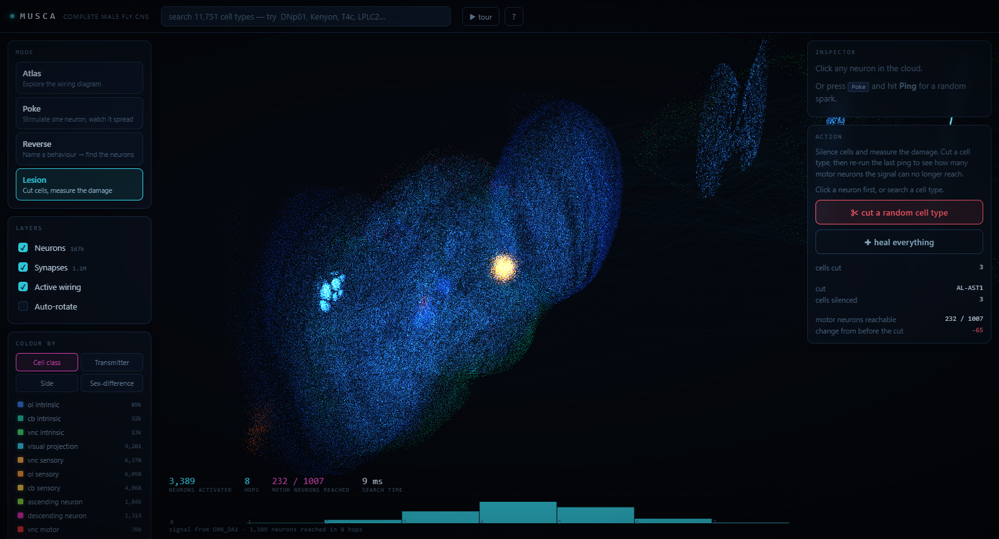

# MUSCA 🪰⚡
### Complete Male Fruit Fly Brain & Reverse Connectome Engine

<p align="center">
  <a href="https://realgauravvyas.github.io/connectomics/musca/">
    
  </a>
  <a href="https://realgauravvyas.github.io/connectomics/">
    
  </a>
</p>

[](https://realgauravvyas.github.io/connectomics/musca/)
[](https://realgauravvyas.github.io/connectomics/musca/)
[](https://realgauravvyas.github.io/connectomics/musca/)
[](https://research.google/blog/a-connectomics-milestone-mapping-the-complete-male-fruit-fly-brain/)
[](https://realgauravvyas.github.io/connectomics/musca/)
[](https://realgauravvyas.github.io/connectomics/musca/)
[](https://opensource.org/licenses/MIT)

> 🌐 **Experience the Live Simulation Online:**  
> 👉 **[https://realgauravvyas.github.io/connectomics/musca/](https://realgauravvyas.github.io/connectomics/musca/)**  
> *166,700 neurons. 124 million synapses. No server, no simulation shortcuts — the real connectome rendered and traversable in WebGL.*

---

## 📸 Interactive Showcase

<p align="center">
  <a href="https://realgauravvyas.github.io/connectomics/musca/">
    
  </a>
</p>

<p align="center">
  <i>The complete male Drosophila CNS, colored by cell class. Every point represents a reconstructed neuron positioned at its real electron-microscopy soma coordinate, enveloped in a 1.1-million-point synapse density haze.</i>
</p>

---

## 🔬 Core Functionality

### 1. Atlas — The Full Wiring Diagram
Every dot is one reconstructed neuron placed at its real 3D soma coordinate from the MaleCNS electron-microscopy dataset. The haze behind them represents a 1.1-million-point sample of real synapse locations giving the central nervous system its authentic anatomical shape.
- Color by **Cell Class**, **Neurotransmitter** (Acetylcholine, GABA, Glutamate, Dopamine, Octopamine, Serotonin), **Hemisphere**, or **Sexually Dimorphic** circuits.
- Search across **11,779 cell types**. Click any neuron to inspect its strongest afferent inputs and efferent outputs.

### 2. Poke — Forward Spike Diffusion
Select any cell, fire an action potential, and watch neural activity radiate outward.

<p align="center">
  
</p>

The wave is a decaying, weight-scaled diffusion across the real 2.82M-edge adjacency matrix:
- Races down the optic lobe's parallel processing channels.
- Squeezes through anatomical bottlenecks.
- Traverses descending neurons (DNs) from the central brain into the ventral nerve cord (VNC).
- Real-time HUD displays total reached neurons, hops traversed, and motor pools engaged.

### 3. Reverse — Behavior $\rightarrow$ Circuits
Name a behavioral response, and MUSCA executes a max-strength route search across 2.8 million connections to find the exact biological circuit responsible.

<p align="center">
  
</p>

#### Shipped & Experimentally Validated Behaviors:

All 9 shipped behaviors are algorithmically validated against the real connectome using `tools/behaviours.py`:

| Behavior | Validated Circuit Route in Connectome | Hops |
|---|---|:---:|
| **Escape jump** | `LPLC2 → DNp01 → TTMn` *(Giant-fiber escape circuit)* | 2 |
| **Sing back** | `JO-A1 → SAD103 → DNp02 → AN19B001 → DLMn a, b` | 4 |
| **Follow an odour** | `ORN_DA1 → AL-AST1 → DNge054 → DNg100 → IN09A002 → ltm1-tibia MN` | 5 |
| **See a shadow** | `R1-R6 → L2 → Tm2 → LC4 → DNp01` | 4 |
| **Steer a turn** | `T4c → vCal3 → DNp31 → DLMn c-f` | 3 |
| **Startle to sound** | `JO-A1 → SAD109 → DNp01 → TTMn` | 3 |
| **Walk to a smell** | `ORN_DC2 → il3LN6 → M_l2PNl20 → SIP022 → AOTU019 → PS232 → DNg01_a` | 6 |
| **Taste and reach** | `BM_Taste → GNG015 → MN9` | 2 |
| **Remember an odour** | `ORN_DA1 → DA1_lPN → APL → MBON01` | 3 |

### 4. Lesion — In-Silico Neurological Damage
Target any neuron or region to ablate it. Re-run forward pokes or reverse searches to quantify motor reach degradation and behavioral loss.

<p align="center">
  
</p>

---

## 💻 Local Setup & Offline Validation

MUSCA loads pre-compiled binary arrays (`data/edges.bin`, `data/neurons.bin`, `data/synapses.bin`) totalling ~30 MB, ensuring fast page load with zero server runtime.

```bash
# Clone the repository
git clone https://github.com/realgauravvyas/connectomics.git
cd connectomics/musca

# Validate all 9 biological behavioral routes offline
python tools/behaviours.py

# Launch local server
python -m http.server 8000
# → Open http://localhost:8000/
```

---

## 🌐 Complete Connectomics Ecosystem

MUSCA is an integral engine in the [**CONNECTOMICS**](https://realgauravvyas.github.io/connectomics/) simulation suite:

- ⚡ **[166k](https://realgauravvyas.github.io/connectomics/166k/):** Large-scale Leaky Integrate-and-Fire (LIF) spiking electrophysiology with dopamine conditioning.
- 🌌 **[SYNAPTICA](https://realgauravvyas.github.io/connectomics/synaptica/):** 12 mapped neuropil hubs with real-time Hebbian plasticity tracking.
- ♟️ **[FlyGambit](https://realgauravvyas.github.io/connectomics/fly-gambit/):** Sparse *Drosophila* connectome learning chess with interactive mid-game brain lesioning.
- 🏃 **[FlySprint](https://realgauravvyas.github.io/connectomics/fly-sprint/):** 1–5 evolved flies with 94-weight neural gait controllers racing 100m–400m and hurdles.
- 🧠 **[FLYMIND](https://realgauravvyas.github.io/connectomics/flymind/):** Interactive connectome playground: poke senses, train mushroom body, explore 42 neuron classes.
- ⚽ **[FLYKICK](https://realgauravvyas.github.io/connectomics/flykick/):** 2 teams of neural flies play football with real-time Brain Cam and manual possession override.

---

## 📚 Scientific References

- **Google Research & HHMI Janelia**: *"Sexual dimorphism in the complete connectome of the Drosophila male central nervous system"*, **Cell** (September 2026).
- **Google Research Announcement**: [A connectomics milestone: Mapping the complete male fruit fly brain](https://research.google/blog/a-connectomics-milestone-mapping-the-complete-male-fruit-fly-brain/).
- **MaleCNS Connectome Portal**: [male-cns.janelia.org](https://male-cns.janelia.org/).

---

## 👤 Author & Research

**Gaurav Vyas**  
- 🌐 **Personal Website & Academic Profile:** [socialpsychology.org/member/gaurav-vyas](https://www.socialpsychology.org/member/gaurav-vyas)  
- 🔶 **Interactive Portfolio:** [realgauravvyas.github.io](https://realgauravvyas.github.io/)  
- 🐙 **GitHub:** [@realgauravvyas](https://github.com/realgauravvyas)  
- 🪰 **Parent Suite:** [CONNECTOMICS](https://realgauravvyas.github.io/connectomics/)

---

## 📄 License

MIT License &copy; 2026 Gaurav Vyas. Open-source science under the MIT License.
